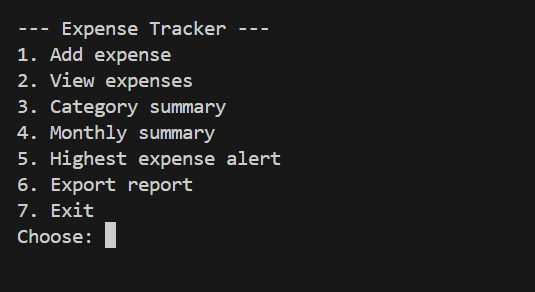
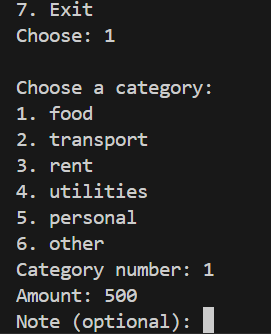
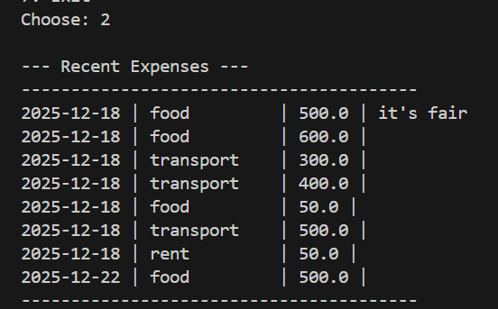

💰 Expense Tracker (CLI)

A simple and practical Python command-line application for tracking daily expenses, organizing them by category, and generating useful summaries.

This project focuses on clean code, real-world logic, and working with persistent data.

📌 What This Project Does

Records daily expenses

Organizes expenses by category

Stores data locally in CSV format

Generates summaries and insights from saved data

🚀 Features

➕ Add new expenses (amount, category, date)

📋 View all recorded expenses

📊 Category-based expense summary

🚨 Highest expense alert

📤 Export expenses to CSV report

✅ Input validation for safer data entry

🗂️ Expense Categories

Food

Transport

Utilities

Entertainment

Other

🛠️ Technologies Used

Python

CSV file handling

Git & GitHub

Command-line interface (CLI)

▶️ How to Run the Project

Clone the repository:

git clone https://github.com/ashenafimohammed475-bot/EXPENSE-TRACKER.git

Navigate to the project folder:

cd expense-tracker

Run the application:

python main.py

## Screenshots

## 📸 Screenshots

### Main Menu

### Adding an Expense

### Category Summary

### Highest Expense Alert

Example:

Main menu

Category summary

Highest expense alert

🎯 Why This Project?

This project was built to strengthen real-world Python skills, including:

File handling and persistence

Input validation

Data aggregation and analysis

Function-based program design

Writing maintainable CLI applications

🔮 Future Improvements

Monthly and yearly summaries

Data visualization (charts)

SQLite database support

GUI or web version (Flask)

👤 Author

Mohammed
Aspiring software developer focused on practical problem-solving and continuous learning.
